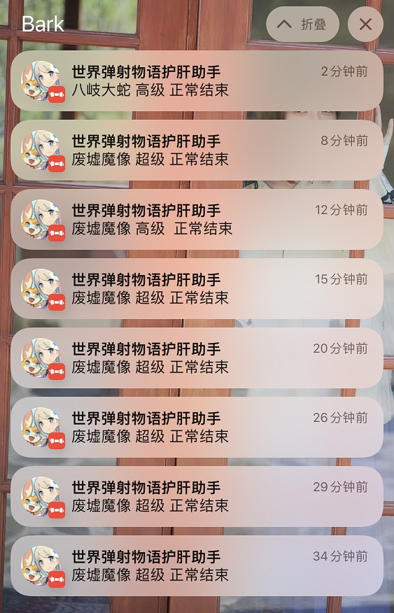

# wf-auto

世界弹射物语 自动挂铃铛

## 已实现

- 全自动进铃铛/准备/判断结束返回/判断房间已满
- 使用Bark推送至手机查看状态
- 遇到未标记的Boss自动截图存储
- 打完自动截图结果存储至`results`文件夹中

## 已知bug

- 返回主界面偶尔失效

## Demo



~~已经刷吐了~~

----

## 模拟器测试环境

- BlueStacks 5.4.100.1026 N64

- Nougat 64 位元 (支援 Hyper-V) 版本

## 模拟器设置

### 显示

- 直向
- 720*1280
- 像素密度 240DPI(中等)

### 图形 

- 图形引擎模式：效能

- 图形渲染器：DirectX
- 界面渲染器：Auto

### 进阶  

- 安卓调试桥：开

> 其他模拟器未测试

### 游戏
世界弹射物语 官服

----

## 依赖

`opencv image_similarity_measures PIL numpy`

同时需要配置好adb

## Boss配置

```
{
	"name": "boss_fire_super", <- 用处不大
	"friendly_name": "废墟魔像 超级", <- 推送、日志记录
	"ref_img": "boss_fire_super.bmp", <- reference文件夹下需要存在此文件
	"target": 1 <- 0/1 是否要刷
}
```

## 使用

```
python main.py fast ip=localhost port=5555
```
参数

| 参数 | 默认值 | 说明 | 是否可选 |
| ---- | ---- | ---- | ---- |
| fast | |非第一次启动可以加快速度 | True |
| ip | localhost|模拟器的ADB IP | True |
| port | 5555 | 模拟器ADB端口 | True |

## 致谢

- 参考了https://github.com/littleplane321/WorldFlipper-OCR-AUTO
